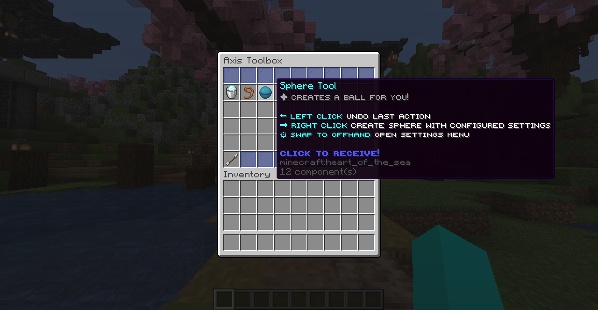
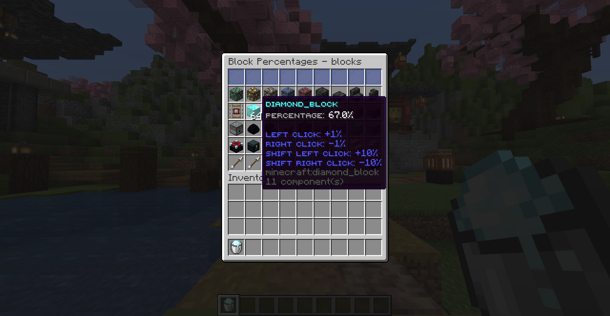
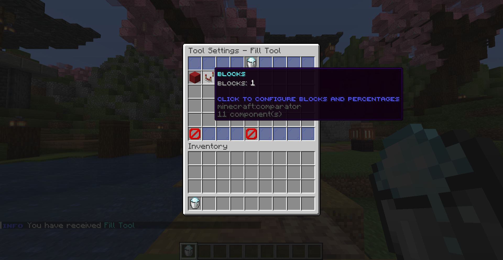

# Axis 🧭

Axis is a modern world editing tool that's fast, simple, and easy to use. It uses a clean, minimal interface to make editing worlds quick and straightforward.

## NOTE
This plugin is still in early development, Pull Requests are welcome.
For more information, join our [Discord](https://discord.gg/f6rUtpy6y4)

## Features ✨

- ⚡ **Fast Editing**: Handles big edits easily and quickly.
- 📦 **.axis Format**: Save and share with a custom file format, similar to WorldEdit schematics.
- 🧼 **Simple UI**: No clutter—just the tools you need.
- 🛠️ **Editing Tools**: Includes Selection Tool, Fill Tool, Sphere Tool, and more.
- 🖱️ **Tool Settings**: Each tool has settings you can change in the UI.
- 📑 **Per-Item Settings**: Settings are saved on each tool item, so you can have several tools of the same type with different materials or options.

## Why Axis? 🤔

- Built for speed and simplicity.
- Works for small tweaks and large changes.
- Easy to share with the `.axis` format.
- Flexible tools you can customize as you like.

## Benchmarks 📊
Soon

## API 🛠️
Soon

## Screenshots 🖼️

*Minimal and clean toolbox UI.*

*Browse and select items with ease.*

*Edit tool settings directly from the item interface.*

---

## Contact 📬

For questions or support, reach out in our [Discord](https://discord.gg/f6rUtpy6y4).